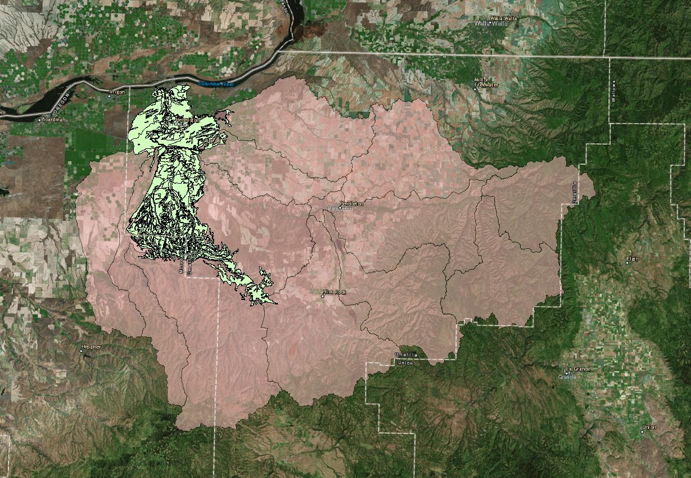

#Shapefiletogeojson

## Data Description

The dataset is the soil type for one of the sub-basin of Umatilla county located in Oregon, US.
The soil type data set is one of the dataset that will be used in developing of the final project.
The final project is a web based decision support system for adaptation planning between water, food and energy sectors in Umatilla county.
The following figure represents the soil-type data-set (Light Green part) for one of the sub-basin in the Umatilla county. 

### Data-set details 

| Name   | Size (mb) |
| ------------- | ------------- |
| Soil.geojson  | 9.17  |
| Soil.simplified.geojson   | 2.25  |
| Soil.simplified.topojson   | 1.85  |

